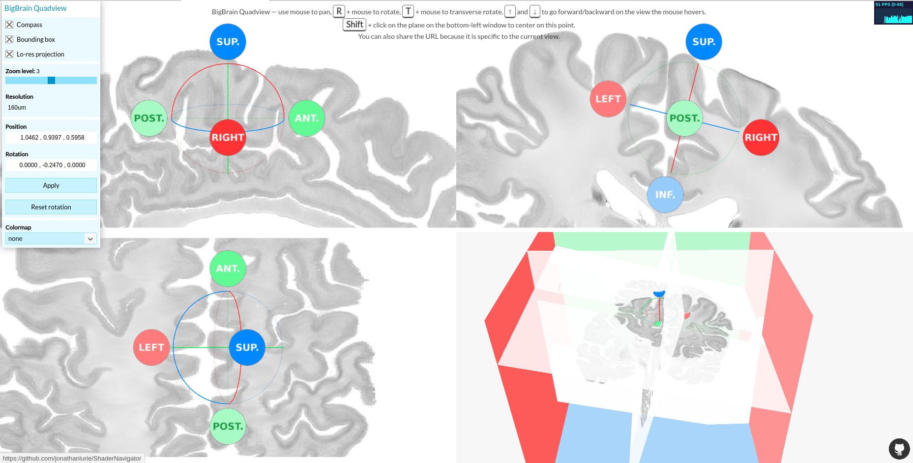

# Shader Navigator

[[DEMO](http://bigbrainviewer.acelab.ca)] using the [BigBrain](https://bigbrain.loris.ca/) data.  

A work in progress to perform arbitrary slicing (aka. obliques) of large voxel dataset, using shaders on GPU, webGL, an octree data structure and few other things.



# Dependencies
We use [Rollup](https://github.com/rollup/rollup) to generate a singe file project compatible with ES6 spec. Install it globally with:

```sh
npm install -g rollup
```
At some point, we were using using Gulp to auto generate the project at every update, but it does not play well with the Rollup plugin that transform shader files into JS string.  

We use [DocumentationJS](https://github.com/documentationjs/documentation) (as a *devDependencies*) to generate the documentation.

# Building

**Build project:**
```sh
$ npm run build
```
The single file output is `build/shadernavigator/shadernavigator.js`  

**Build a minified project:**
```sh
$ npm run build-min
```
The single file output is `build/shadernavigator/shadernavigator.min.js`

---

**NOTE:** ShaderNavigator was developed using ES6 standards meaning the regular/not-minified version uses ES6 classes, among other ES6 features. The minified version is automatically generate in ES5 and uses *object prototypes*.  
While it's easier to maintain the codebase in ES6, the minified version is certainly compatible with more older browsers.

---

**Build the documentation:**
```sh
npm rund doc
```
The documentation is a web project (with an `index.html`) located in the folder `doc`.

# Configure
**ShaderNavigator** needs to be fed with a multiresolution octree architecture of 3D tile data. This config occurs in the file `ShaderNavigator/index.html`:

```js
// create a QuadScene instance
var quadScene = new SHAD.QuadScene("container", 0);

// loads the octree of 3D texture using the tileset config file
quadScene.loadData({
    datatype: "precomputed_octree_tiles",
    url: "../data_raster/info2.json"
});
```

Using the very same pattern, you can load other kind of data, like...

**A collection of meshes**

```js
// Loads the mesh collection using a mesh config file
quadScene.loadData({
    datatype: "mesh_collection",
    url: "../data_mesh/meshes/bigbrain_gray.json"
});
```

**A collection of colormaps**

```js
// loads the colormaps using a colormap config file
quadScene.loadData({
    datatype: "colormap_collection",
    url: "colormaps/colormaps.json"
});
```

*Note: the config file URL used above are local but could absolutely be remote, as long as the server allows [CORS](https://developer.mozilla.org/en-US/docs/Web/HTTP/Access_control_CORS).*

# Auto positioning with URL args
*[Optional]*
As you can see in `ShaderNavigator/index.html`, an instance of `SHAD.HashIO()` is used to parse the URL and position and rotate automatically the orthogonal planes.  

Let's see how it works:

```
http://localhost:5000/ShaderNavigator/index.html#4/1.0177538710434886,1.0044899689452085,0.9562499976158154/-0.23786303165127878,0.2604096266561844,-1.0412456579550184e-16
```
The part to consider is after the **hash** (#):

```
4/1.0177538710434886,1.0044899689452085,0.9562499976158154/-0.23786303165127878,0.2604096266561844,-1.0412456579550184e-16
```

The pattern is the following:  
**zoomLevel** / **xPosition** / **yPosition** / **zPosition** / **xEuler** / **yEuler** / **zEuler**

- zoomLevel, integer values in [0, 6] with:
  - 0 --> 1280um
  - 1 --> 640um
  - 2 --> 320um
  - 3 --> 160um
  - 4 --> 80um
  - 5 --> 40um
  - 6 --> 20um
- xPosition, yPosition and zPosition, in [0, 2]. this is the equivalent of [0, 8192] pixel at 20um.
- xEuler, yEuler and zEuler, the [Euler angle](https://en.wikipedia.org/wiki/Euler_angles) in radians, in [-π, +π].

**Why using it?**
Setting URL arguments is not mandatory (and can actually be quite cumbersome), meaning you can use a URL with no args, like `http://localhost:5000/ShaderNavigator/index.html` and the otho planes will be automatically positioned in the middle of the dataset.

**Still**, the URL args will be updated as long as you move and rotate within the dataset, making it easy to refresh the browser page and go back to the same position, or to share a URL so that a collaborator can go to the same position.


# Run
Run a web server in the root directory and open `ShaderNavigator/index.html`.

# Config file
## axisInfo
This group is mandatory and give some important information about the three axis. By default, we consider the original dataset has been enlarged or padded to fit a power of 2 size (required for zooming). The information about the original size, the enlarged size and the offset are essential to build a bridge between multiple visualization platforms, for example from ShaderNavigator to Atelier3D (where data are not enlarged).  
The three axis **x**, **y** and **z** from the internal 3D space do not necessary respect the **x**, **y** and **z** for the original data and they may even not be called so in the original dataset. Still, having named axes usually matters to the user.


```javascript
"axisInfo": {
  "x": { // "x" from the webGL environment
    "name": "sagittal", // name of this axis in the original dataset
    "originalSize": 6572, // size of the original dataset along this axis, before being extended to a power of 2 size
    "offset": 810, // offset applied at the beginning of the axis, if extended (can be 0)
    "finalSize": 8192, // power of 2 size (can be the same as originalSize if already pow of 2)
    "minName": "left", // name of the min bound of the axis
    "maxName": "right", // name of the max bound of the axis
    "reversed": true  // should we count from 0->8191 (false) or from 8191->0 (true)
  },
  "y": {
    "name": "coronal",
    "originalSize": 7404,
    "offset": 0,
    "finalSize": 8192,
    "minName": "posterior",
    "maxName": "anterior",
    "reversed": false
  },
  "z": {
    "name": "axial",
    "originalSize": 5711,
    "offset": 1240,
    "finalSize": 8192,
    "minName": "inferior",
    "maxName": "superior",
    "reversed": true
  }
},
```
